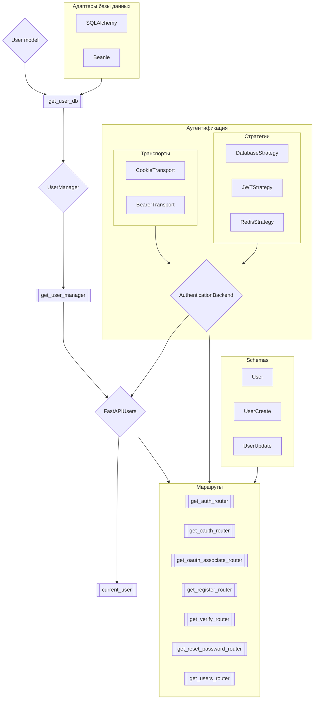

# Обзор

Схема ниже показывает структуру библиотеки и взаимодействие ее частей.

## Модель пользователя и адаптеры базы данных

FastAPI Users совместим с различными **базами данных и ORM**. Чтобы построить интерфейс между этими средствами базы данных и библиотекой, мы предоставляем классы адаптеров базы данных, которые вам нужно создать и настроить.

➡️ [Я использую SQLAlchemy](databases/sqlalchemy.md)

➡️ [Я использую Beanie](databases/beanie.md)

## Аутентификационные бэкенды

Аутентификационные бэкенды определяют способ управления сеансами пользователей в вашем приложении, такими как токены доступа или куки.

Они состоят из двух частей: **транспорта**, который определяет, как токен будет передаваться в запросах (например, в куках, заголовках...) и **стратегии**, которая определяет, как токен будет создаваться и обеспечиваться (например, JWT, токен в базе данных...).

➡️ [Настройка аутентификационных бэкендов](./authentication/index.md)

## `UserManager`

Объект `UserManager` несет основную логику FastAPI Users: регистрация, верификация, сброс пароля и т. д. Мы предоставляем `BaseUserManager` с этой общей логикой, которую вы должны перегрузить, чтобы определить, как проверять пароли или обрабатывать события.

Этот объект `UserManager` должен предоставляться через зависимость FastAPI, `get_user_manager`.

➡️ [Настройка `UserManager`](./user-manager.md)

## Схемы

FastAPI широко использует [модели Pydantic](https://pydantic-docs.helpmanual.io/) для проверки данных запросов и сериализации ответов. **FastAPI Users** не является исключением и ожидает, что вы предоставите модели Pydantic, представляющие пользователя при его чтении, создании и обновлении.

➡️ [Настройка схем](./schemas.md)

## `FastAPIUsers` и маршруты

Наконец, объект `FastAPIUsers` является основным классом, из которого вы сможете создавать маршруты для классических запросов, таких как регистрация или вход, а также получать фабрику зависимостей `current_user`, чтобы внедрять аутентифицированного пользователя в свои собственные маршруты.

➡️ [Настройка `FastAPIUsers` и маршрутов](./routers/index.md)